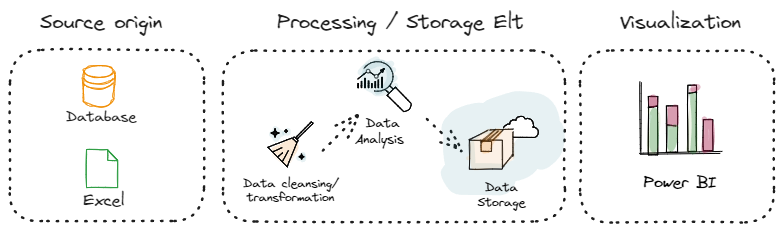

# Basic ELT
This repository demonstrates how to perform a basic Extract, Load, and Transform (ELT) process using two different databases: MySQL and PostgreSQL. In each example, data is imported from a CSV file.

## Table of Contents 📋
+ Introduction
+ Requirements
+ Import CSV to MySQL
+ Import CSV to PostgreSQL

## Introduction 🌟
In this repository, you will find SQL scripts that show you how to perform a basic ELT operation. The scripts import data from a CSV file into either a MySQL or PostgreSQL database.
### Requirements 📦
Before getting started, make sure you have the following requirements installed:

+ MySQL and/or PostgreSQL installed and configured
+ A sample CSV file to import
### Import CSV to MySQL
[import_csv_to_mysql.sql](import_csv_to_mysql.sql)
### Import CVS to PostgrSQL
[import_csv_to_postgres.sql](import_csv_to_postgres.sql)
